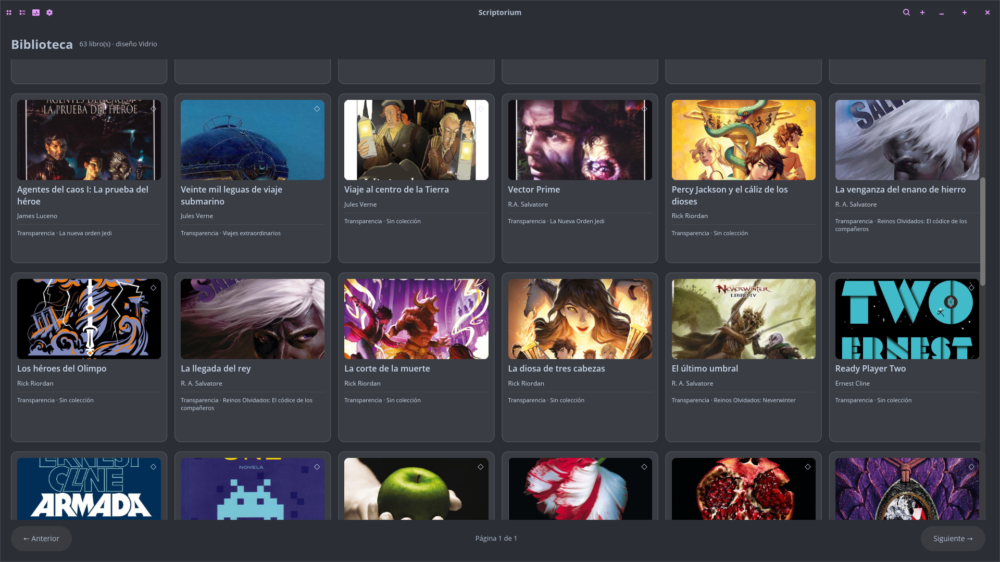
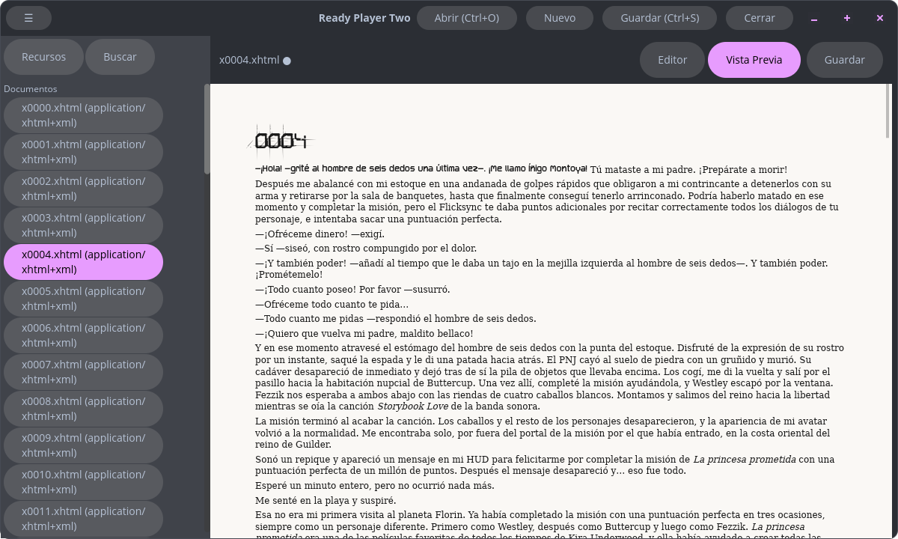
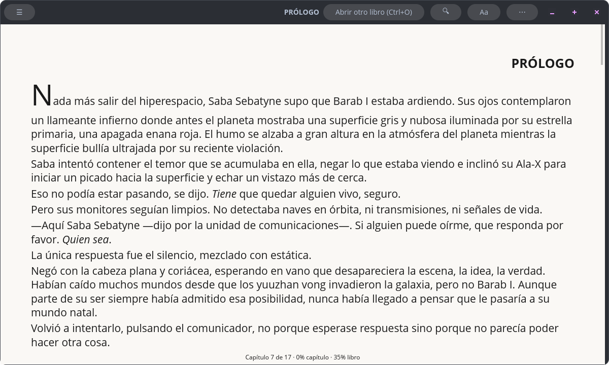

<div align="center">
  
  <h1>Guten</h1>
  <p>Suite de escritorio en Rust para editar, organizar y leer libros EPUB.</p>
  <p><strong>Estado: pre-alpha, en desarrollo activo.</strong></p>
</div>

## Qué es Guten

Guten reúne tres aplicaciones que cubren el ciclo de trabajo de una biblioteca
digital. Los nombres y responsabilidades son:

| Aplicación | Función | Implementaciones actuales |
|---|---|---|
| **Folio** | Lector de EPUB | GTK4/WebKit (`Folio`) y COSMIC (`Folio-cosmic`) |
| **Rúbrica** | Motor y editor de EPUB | GutenCore / Rúbrica core (`Rubrica`), GTK4 (`Rubrica-gtk`) y COSMIC (`Rubrica-cosmic`) |
| **Scriptorium** | Gestor de biblioteca | CLI/servidor (`Scriptorium`), GTK4 y COSMIC |

`visore` es un componente auxiliar para visualizar y recortar imágenes desde
las interfaces COSMIC.

## Arquitectura

```text
Guten
├── Rubrica/                         GutenCore / Rúbrica core (crate: rubrica)
├── Rubrica-gtk/                     Editor GTK4 + Libadwaita
├── Rubrica-cosmic/                  Editor COSMIC
├── Folio/                           Lector GTK4 + WebKitGTK
├── Folio-cosmic/                    Lector COSMIC con renderizado propio
├── Scriptorium/                     Biblioteca SQLite, CLI, OPDS e importación
│   ├── scriptorium-gtk/             Cliente GTK4
│   ├── scriptorium-iced/            Cliente COSMIC
│   └── scriptorium-pdf-pipeline/    Importación y análisis de PDF
└── visore/                          Visor de imágenes reutilizable
```

Las capas se relacionan así:

1. **GutenCore / Rúbrica core** abre, valida, modifica y exporta EPUB. El
   paquete Cargo se llama `rubrica`, pero los demás componentes lo importan
   localmente con el alias `gutencore`.
2. **Scriptorium** usa Rúbrica para importar libros y mantiene el catálogo en
   SQLite con búsqueda FTS5, deduplicación y servicio OPDS.
3. **Folio** usa Rúbrica para interpretar el EPUB y presentar su contenido.
4. Las variantes GTK4 y COSMIC son clientes de esos núcleos; no son productos
   con responsabilidades diferentes.

## Estado de las aplicaciones

| Componente | Estado actual |
|---|---|
| GutenCore / Rúbrica core | Funcional: estructura EPUB 3, recursos, navegación, saneamiento XHTML y exportación |
| Rúbrica GTK4 | Prototipo funcional de edición y previsualización |
| Rúbrica COSMIC | Prototipo temprano de edición |
| Folio GTK4 | Prototipo funcional de lectura basado en WebKitGTK |
| Folio COSMIC | En desarrollo activo; lectura, estilos, fuentes, anotaciones y TTS |
| Scriptorium CLI | Funcional: importación, catálogo SQLite/FTS5, organización y servidor OPDS |
| Scriptorium GTK4 | Prototipo de cliente de biblioteca |
| Scriptorium COSMIC | Primer corte funcional; catálogo, búsqueda, importación y edición básica de metadatos |
| Pipeline PDF | Experimental; OCR opcional todavía en integración |
| Visore | Componente auxiliar experimental |

No hay todavía una API estable, paquetes de distribución ni una release para
usuarios finales. Los formatos internos y las interfaces pueden cambiar.

## Compilar

### Requisitos

- Rust estable con Cargo (varios crates usan edition 2024).
- `pkg-config` y herramientas de compilación C.
- Bibliotecas de desarrollo de GTK4, Libadwaita, WebKitGTK, GtkSourceView,
  Cairo y SQLite para las variantes que las utilizan.
- En los clientes COSMIC, Wayland y las dependencias nativas de `libcosmic`.

Los nombres de los paquetes cambian según la distribución. En Pop!_OS/Ubuntu
se pueden localizar las dependencias que falten a partir del nombre que
`pkg-config` muestra durante la compilación (por ejemplo, `cairo.pc`).

### Workspace principal

```bash
git clone https://github.com/pclbusto/Guten.git
cd Guten
cargo build --workspace
```

Ejemplos para ejecutar componentes concretos:

```bash
cargo run -p folio
cargo run -p folio-cosmic
cargo run -p scriptorium --bin rubrica
cargo run -p scriptorium-gtk
```

Rúbrica COSMIC (`Rubrica-cosmic`) y Scriptorium COSMIC
(`Scriptorium/scriptorium-iced`) están **fuera del workspace principal por
ahora**. Cada uno mantiene un workspace propio y se ejecuta desde su directorio:

```bash
cargo run --manifest-path Rubrica-cosmic/Cargo.toml
cargo run --manifest-path Scriptorium/scriptorium-iced/Cargo.toml
```

Para comprobar el workspace principal:

```bash
cargo test --workspace
cargo clippy --workspace --all-targets
```

## Capturas

Interfaz temprana; el diseño y las funciones todavía pueden cambiar.

### Scriptorium — biblioteca



### Rúbrica — editor y vista previa



### Folio — lectura



## Roadmap

- [ ] Estabilizar el modelo EPUB compartido y cubrirlo con pruebas de regresión.
- [ ] Unificar nombres, rutas de datos y configuración entre GTK4 y COSMIC.
- [ ] Completar los flujos principales de Folio, Rúbrica y Scriptorium.
- [x] Añadir primeras capturas de las aplicaciones.
- [ ] Ampliar la documentación de uso de cada aplicación.
- [ ] Automatizar compilación, pruebas y lint en CI.
- [ ] Definir paquetes para Pop!_OS/Ubuntu y otros escritorios Linux.
- [ ] Publicar una primera versión pre-release con changelog y binarios.

## Contribuir

Antes de proponer cambios, abrí un issue para acordar alcance y componente. Un
pull request debería indicar qué aplicación modifica y qué comandos se usaron
para validarlo.

## Licencia

Guten se distribuye bajo la [Licencia MIT](LICENSE). Se permite usar, copiar,
modificar y redistribuir el software, incluso con fines comerciales, siempre
que se conserve el aviso de copyright y el texto de la licencia.
